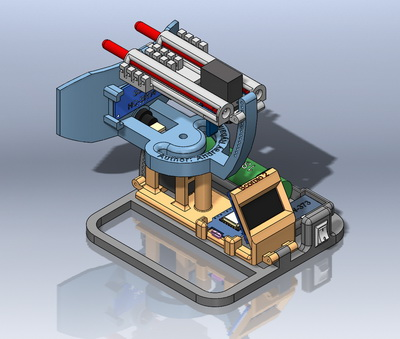
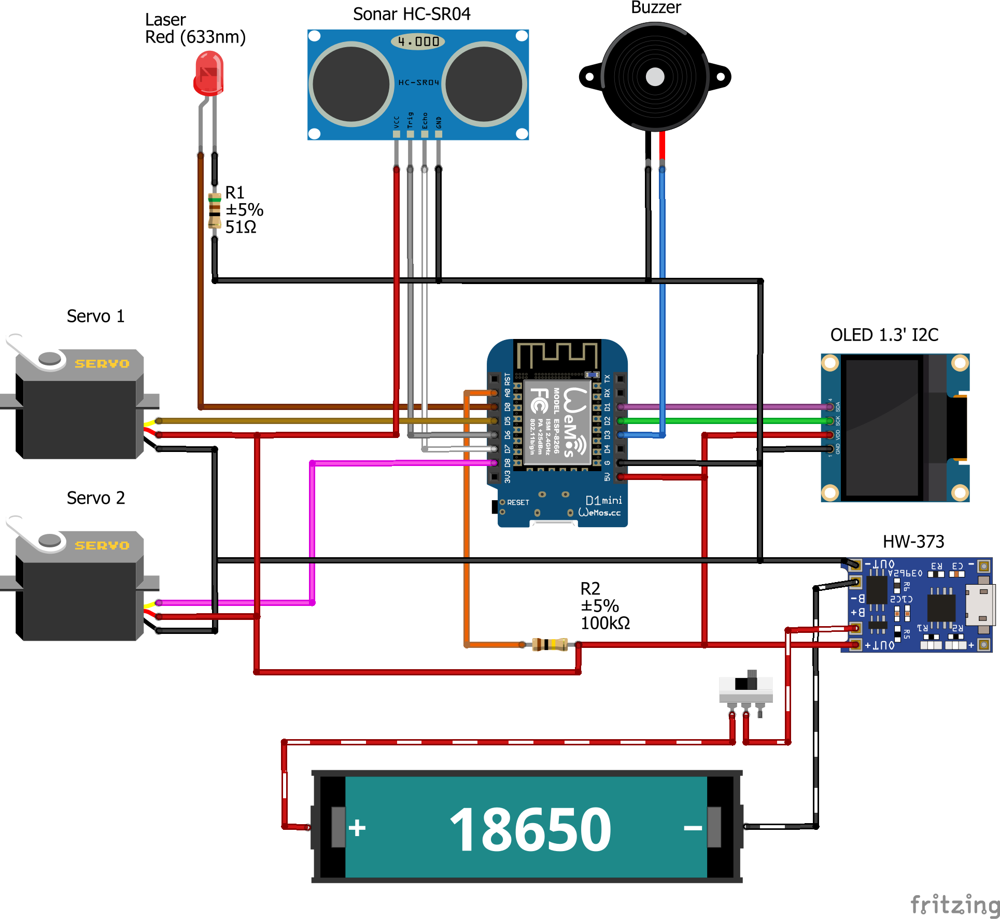

# Scorpio 2

## Video

## 3D Model

## Connection diagram

## How to flash

Download and install Arduino ESP8266 filesystem uploader plugin following the instructions on this page: https://github.com/esp8266/arduino-esp8266fs-plugin

Before uploading the firmware via Arduino IDE, first execute the command Select Tools > ESP8266 Sketch Data Upload

Then you can flash as usual

## Как прошить

Загрузите и установите Arduino ESP8266 filesystem uploader plugin, следуя инструкциям на этой странице: https://github.com/esp8266/arduino-esp8266fs-plugin

Перед загрузкой прошивки через Arduino IDE сначала выполните команду Select Tools> ESP8266 Sketch Data Upload

Потом можно прошивать как обычно
